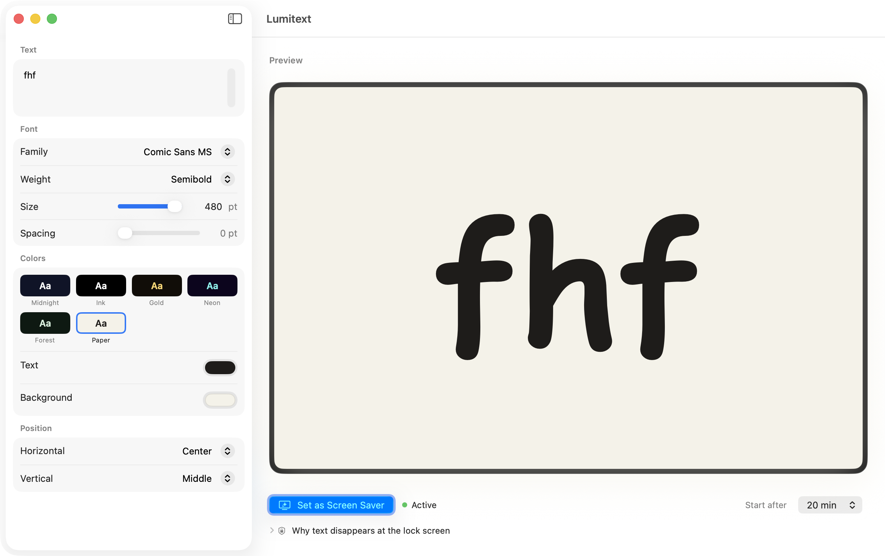

# Lumitext

A custom-text screensaver for macOS Tahoe (26). Type any text — pick the font,
weight, size, color, and position — and it shows as your screensaver, with a live
preview that matches exactly what you'll see.

> **Status:** in active development (pre-release). Built and verified on macOS 26.5.



## Why

macOS has no built-in way to show your own styled text as a screensaver. The native
Lock Screen "message" is a single line of unstyled plain text; the built-in *Message*
screensaver offers no real font/color/size control; and nothing on the App Store or
GitHub renders free-form, fully styled text as a true idle screensaver. Lumitext fills
that gap.

## How it works

Lumitext ships as a normal app that embeds a modern **ExtensionKit screensaver**
(`.appex`, the same format Apple's own screensavers use on Sonoma and later — not the
buggy legacy `.saver` plug-in). You configure everything in the app; the app writes a
small config into a shared **App Group** container; the screensaver reads it and renders
your text. The app's live preview and the screensaver use the *same* rendering code, so
the preview is true WYSIWYG.

```
Lumitext.app  ──writes──▶  App Group container (config.json)  ──reads──▶  LumitextSaver.appex
   (config GUI + preview)                                                   (renders on idle)
        └──────────────── shared SwiftUI renderer (LumitextCore) ──────────────────┘
```

### About "lock screen"

A third-party screensaver renders during the **idle period before macOS secures the
lock screen** — exactly the window every screensaver (including Apple's) runs in. Once
the Mac is truly locked, macOS's login window owns the display and no third-party code
can draw there; that's an OS security boundary, not a Lumitext limitation. Lumitext
helps you align your "start screensaver" and "require password" timings so your text is
visible for as long as possible before the secure lock takes over.

## Requirements

- macOS Tahoe (26.0+). Tahoe-only by design — it uses the modern screensaver extension
  point and is built against the macOS 26 SDK.

## Install

Pre-built signed releases (DMG + Homebrew cask) will be published once the project
reaches its first tagged release. For now, build from source (below).

Sharing an unsigned preview build with someone: `./scripts/make-share-zip.sh
build/Release/Lumitext.app` produces a zip containing the app plus step-by-step
install/unblock instructions (`distribution/安装说明.txt`). Recipients need macOS 26+;
hand-offs via USB/scp open with no prompts, downloads need one Gatekeeper approval
(both paths are covered in the bundled instructions).

## Build from source

Requires Xcode 26 and [XcodeGen](https://github.com/yonaskolb/XcodeGen)
(`brew install xcodegen`).

```bash
git clone https://github.com/fanhefeng/lumitext.git
cd lumitext
swift test --package-path Packages/LumitextCore      # run core unit tests
./scripts/dev-build-install.sh                        # build, sign (ad-hoc), install to /Applications
```

Then open **System Settings → Screen Saver**, pick **LumitextSaver**, and configure the
text in the Lumitext app. See [`CLAUDE.md`](CLAUDE.md) for the full dev loop and
[`PLAN.md`](PLAN.md) for the architecture and roadmap.

## Project layout

| Path | What |
|---|---|
| `App/` | SwiftUI host app — config GUI, live preview, activation, updates |
| `Saver/` | The `.appex` screensaver (private ScreenSaver API via bridging header) |
| `Packages/LumitextCore/` | Shared config model, store, and SwiftUI renderer (+ tests) |
| `scripts/` | Build / sign / package tooling |
| `docs/adr/` | Architecture decision records |

## License

MIT — see [LICENSE](LICENSE).
